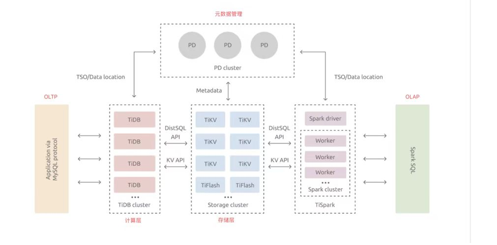
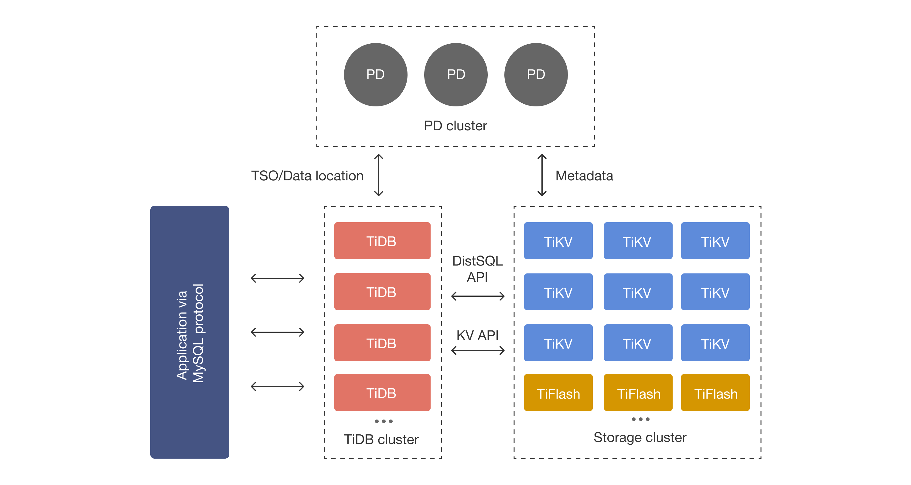
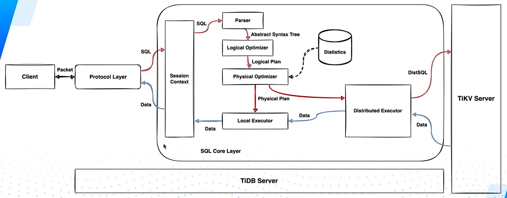
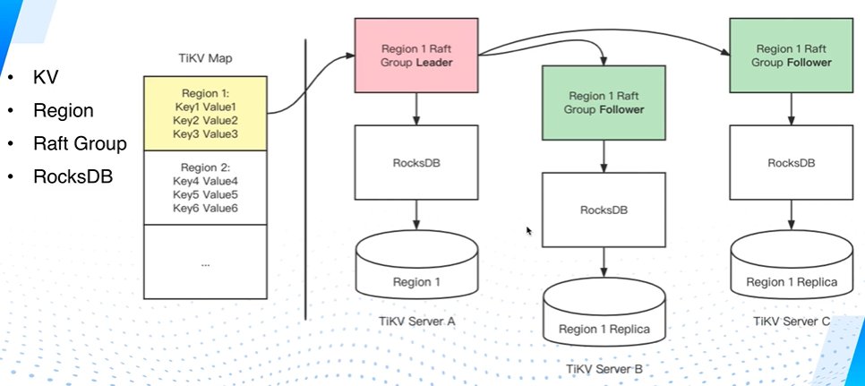
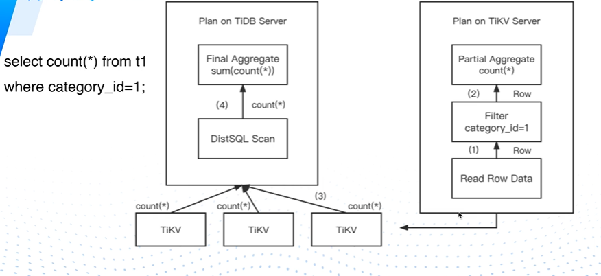
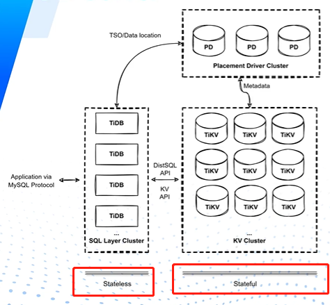

# 1-整体架构

对于TiDB来说，最核心的是：PD Cluster、TiDB Cluster、Storage Cluster这3部分。TiSpark是用来做流处理的。关于TiDB的架构，有以下要点：

1. TiDB兼容MySQL协议，也就是说客户端可以使用MySQL的语句来操作TiDB Cluster。
2. Storage Cluster包含了许多TiKV节点、TiFlash节点，数据也是存储在这些节点上。
3. 顾名思义，对于TiKV来说，数据以K-V结构组成的键值对存储，有点类似Redis的结构。
4. TiDB作为一个分布式的数据库，数据在TiKV上存储，肯定不是普通的一份，它会采用跨TiKV分片冗余的方式存储。数据在TiKV上的分片单位叫**Region，它有Leader和Follower的身份，Leader负责写入，Follower负责读取和备份。我认为可以把Region理解为Kafka的Replica**。
5. 客户端的写请求、读请求到达TiDB Cluster以后，TiDB Cluster作为1个无状态的服务，数据实际存储在Storage Cluster上。TiDB Cluster需要和Storage Cluster进行交互（通过KV API和DistSQL API），完成数据的写入 与 读取。
6. PD Cluster它也有Leader、Follower之分，存储着整个TiDB集群的元数据，包含数据所在的TiKV位置。也就是说，当TiDB准备插入、查询数据时，会先经过PD Cluster获取数据对应的位置（Data Location），再进行下一步操作。有点类似Zookeeper或Kraft对于Kafka的作用。
7. TiDB和PD Cluster还会交互一种叫TSO的时间戳，因为TiDB本身支持CP的分布式事务，为了维护CP分布式事务，TiDB会进行多次数据行为。TSO正是为了保证多次数据行为的有序性而存在的。

# 2-TiDB Server的作用

TiDB Cluster由多台TiDB Server组成，TiDB Server的架构图如下：

1. TiDB Server最大的作用是，对客户端假装成一个MySQL数据库，接收来自客户端的MySQL协议请求，最终生成一个执行计划。通过Distributed Executor 和 Storage Cluster进行交互，**Distributed Executor可以并行地执行1个客户端请求的SQL语句（这就是Golang的好处了，用Goroutine实现高IO操作）**。
2. TiDB Server本身是无状态的，它不负责存储任何数据。即使某台Serer挂了，客户端可以通过负载均衡器，将请求转发到另一台TiDB Server上执行，也是可以的。
3. TiDB通过Protocol Layzer实现MySQL协议，通过Session Context校验和保存 连接 的会话信息。
4. 请求到达Parser后，会询问PD Cluster，确定这次目标数据的Data Location。并且将客户端传过来的SQL解析成语法树。
5. 语法树会被Logical Optimizer进行优化，改写一部分内容，改善SQL语句的执行效率，并且生成Logical Plan。Logical Plan被Physical Optimizer再次优化，**这次优化有很大不同，因为会参考前面执行结果生成的统计信息**，生成最终的Physical Plan（优化再优化的结果）。
6. Physical Plan会被两个执行器执行：Local Executor和Distributed Executor，前者是处理那些 影响TiDB Server本身的请求，后者是处理那些 影响Storage Cluster实际数据的请求。
7. Storage Cluster返回数据后，经过Distributed Executor、Local Executor、Session Context、Protocol Layer返回给客户端。

# 3-MySQL行与TiKV的KV

对于TiKV来说，数据是以K-V键值对的方式进行存储。总的来说，Key的格式为：t${TableId}_r${RowId}。

假设MySQL有这么一张User表：

| user_id | username | gender |
| ------- | -------- | ------ |
| 1       | abc      | 1      |
| 2       | def      | 1      |
| 3       | ghi      | 0      |

如果将上面的User表映射成TiKV的Key和Value，会是

| Key    | Value       |
| ------ | ----------- |
| t10_r1 | [1,"abc",1] |
| t10_r2 | [2,"def",1] |
| t10_r3 | [3,"ghi",0] |

t10里的t代表table前缀，这是写死的。10代表User表在TiDB里的**全局唯一ID**，它记录在PD Cluster里面。

r1里面的r代表row的前缀，它也是写死的，1代表在ID=10的TiDB表里记录所在的行ID。

也就是说，t10_r1代表[1,"abc",1]在id=10的表的id=1的行里。

# 4-Region的作用

前面说到，行记录会被转成KV，存储在TiKV内。KV在TiKV的TiKV Map里存储着，它是一个非常大的Map，保存着这个TiKV的所有KV。

TiKV Map会将一段连续的KV（按照Key的顺序）划分为1个Region，1个Region默认大小是96MB。**有点类似MySQL将一段连续的行记录（按照主键ID顺序）划分为个Page，1个Page的默认大小是16KB。**

Region本身是副本存储的，可以看成Kafka的Partition，包含Leader和Follower，数据被写入Leader后，会被同步到其他Follower上。**只有其他Follower同步成功后，数据才被视作写成功，也就是说Region的写入是强一致性的**。如果某个Follower挂掉，不会影响Leader的写入，直到这个Follower重新启动，Leader会将挂掉的数据重新同步过去。

因为Region的主从是通过[Raft算法](https://github.com/9029HIME/Emphasis/blob/master/project_emphasis/src/main/mds/04-%E5%88%9D%E8%AF%86Raft%E7%AE%97%E6%B3%95.md)决定的，当Leader挂掉后，PD Cluster会及时从Follower中选一个新Leader出来，保证Region的可用性。

TiDB的数据写入不是以一条KV为单位的，如果一条一条地写入，Region之间的数据同步、网络IO会非常频繁。**因此TiDB的主从同步，以Region为单位**。

TiDB采用RocksDB作为存储引擎，将Region的数据刷盘到磁盘，保证最终的持久性。

# 5-分布式SQL在TiDB的执行逻辑（2的补充）

比方说执行SELECT COUNT(*) FROM t1 WHERE category_id = 1; TiDB Server在语法解析、逻辑优化、物理优化后，会走这样流程：

1. 先问PD Cluster，这些数据会在哪些Region（TiKV）。因为catetory_id是比较普遍的字段，并不能代表某行记录的唯一性，因此这些记录往往存在于不同Region内。
2. TiDB Server的Distributed Executor会并行地请求这些Region，每个TiKV根据条件得出结果值，返回给TiDB Server
3. TiDB Server将不同TiKV的值进行汇总，形成最终的结果值，返回给客户端。

# 6-PD Server的作用

1. 其实上面也讲过了，TiDB Server作为无状态的服务，本身不存储数据。Storage Cluster作为有状态的服务，实际存储数据。而PD Cluster则是无状态 到 有状态过度的一个桥梁。

2. 它不仅存储着整个TiDB集群的元数据，还存储着TiKV数据的**实时**分布情况（注意这个实时，到底是AP还是CP，要留个坑）、分配分布式事务ID等全局功能。

3. 并且还会根据TiKV实时上报的数据分布情况，给TiKV下发实时的数据调度命令。
4. 可以说，客户端操作TiDB的命令，基本都会经过PD Server的处理。
