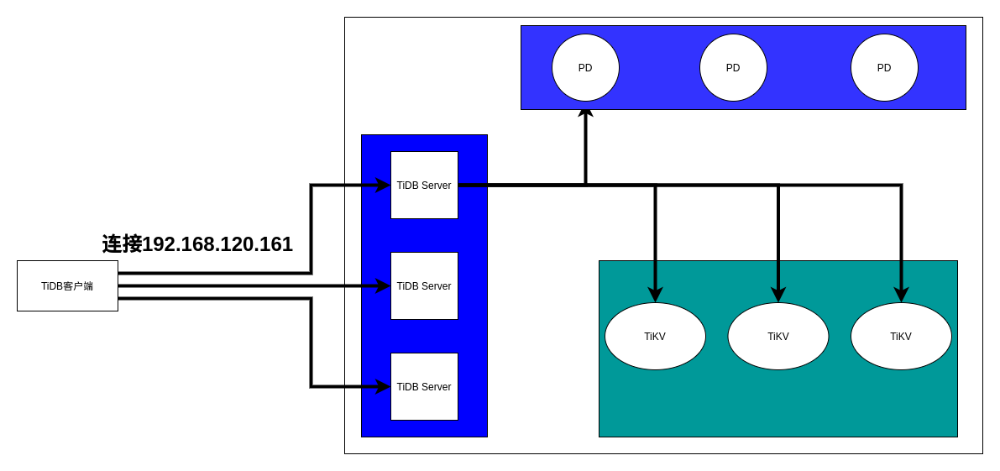

# TiDB的本地搭建（伪集群）

下载TiUP

```bash
root@kjg-PC:~# curl --proto "=https" --tlsv1.2 -sSf https://tiup-mirrors.pingcap.com/install.sh | sh
  % Total    % Received % Xferd  Average Speed   Time    Time     Time  Current
                                 Dload  Upload   Total   Spent    Left  Speed
100 7088k  100 7088k    0     0  1184k      0  0:00:05  0:00:05 --:--:-- 1646k
WARN: adding root certificate via internet: https://tiup-mirrors.pingcap.com/root.json
You can revoke this by remove /root/.tiup/bin/7b8e153f2e2d0928.root.json
Successfully set mirror to https://tiup-mirrors.pingcap.com
Detected shell: bash
Shell profile:  /root/.bashrc
/root/.bashrc has been modified to add tiup to PATH
open a new terminal or source /root/.bashrc to use it
Installed path: /root/.tiup/bin/tiup
===============================================
Have a try:     tiup playground
===============================================
```

通过TiUP指定TiDB Server、TiKV Server、PD的实例数，在本地搭建集群：

```
# 添加tiup的命令到环境变量
source /root/.bashrc
# 这里指定3个TiDB Server，3个TiKV Server，3个PD。
tiup playground v6.1.0 --db 3 --pd 3 --kv 3 --host 192.168.120.161
```

最终的架构图如下：

