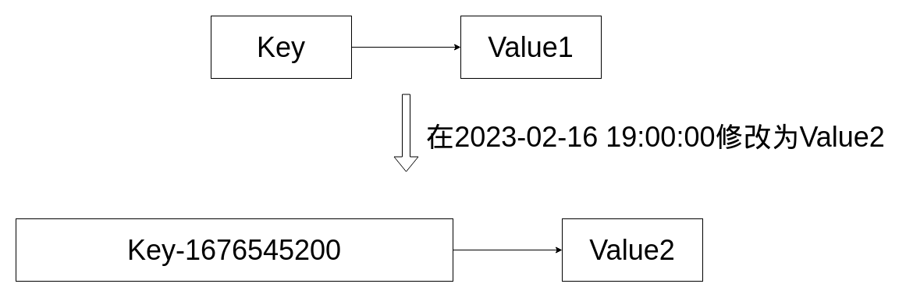

# 1-闪回表（顺带提出MVCC）

TiDB自身有垃圾回收机制（依赖Golang），TiDB的闪回表（Flashback Table）指的是GC之前被还原的已删除表。

假设有一张表ft01，它在2023-02-16 19:00:00被删除，但我后悔了，想恢复它。

我可以通过SELECT * FROM mysql.tidb WHERE variable_name = 'tikv_gc_safe_point'找到最近一次GC的时间。

如果tikv_gc_safe_point < 2023-02-16 19:00:00，那ft01可以被闪回，反之则不行。

如果ft01可以闪回，那可以通过 flashback table ft01 to new_table，将ft01里面**处于tikv_gc_safe_point之后的数据**闪回到新表new_table。

闪回表基于TiDB的MVCC实现，TiDB对于MVCC的实现是：当KV被执行写操作后，新的行记录值的Key会附带一个时间戳，时间戳的值是修改时刻，原来的Key还不会被删除。落实到图上，是这样的：



**当然，实际没有这么简单，这得到后面了解TiDB的MVCC，才能发现本质。或许和MySQL的类似，也是基于链表呢？**

# 2-AUTO_INCREMENT

AUTO_INCREMENT可以自动填充默认字段值，使其自增。在MySQL的常见使用场景是控制主键ID自增。

TiDB通过TiDB Server维护自增属性，但是TiDB Server采用分布式存储，每个Server都维护自己的AUTO_INCREMENT属性是做不到全局自增的。

这时候，可能会想到PD来维护全局自增性，这样做理论上是可行的，无论哪个TiDB Server要插入数据，都事先从PD拿到这条数据的自增值，但是这样做性能会比较差。

因此PD将自增的值预先分配给每台TiDB Server，比如现在有两台Server，其中一台冗余了[1,500]的自增值，另一台冗余了[501,1000]的自增值。当自增值用完后，重新从PD里获取一批。

那么问题来了，如果客户端第一次写数据请求[1,500]的Server，数据的id会是1，第二次写数据请求[501,1000]的Server，那数据的id会是501，还是做不到全局自增啊？确实是这样的，而且AUTO_INCREMENT还不止这一个局限性，下面还会介绍。

可以通过SHOW VARIABLES LIKE 'auto_increment_%';来查看自增值的缓存范围。也可以通过 LAST_INSERT_ID()这个函数获取上一次写数据的ID，这个应该和MySQL一样，也是仅限在会话内有效的。 

# 3-Region单点热写与AUTO_INCREAMENT问题的引出

原来，如果用MySQL那样的DDL创建一张表，在TiDB里默认只分配1个Region。那这样和普通的MySQL表没什么区别了，所有TiDB Server的写入请求都打在1个Region上，它的Follower只能旁观啥也做不了。

同样的，如果采用AUTO_INCREMENT，在同一片ID的范围内，数据也是写进同一个Region内，也是会有单点热写的问题（而且TiDB的AUTO_INCREAMENT也不能做到真正的全局自增）。

为了避免单点热写问题，需要对Region进行切分。

因此在创建表的时候，可以通过：

```sql
CREATE TABLE t (a int,b int) SHARD_ROW_ID_BITS = 4 PRE_SPLIT_REGIONS = 3;
```

来指定Region的数量，其中前面的4代表记录的row_id值会随机分布在 2的4次方 个范围内，也就是16个范围内。后面的3代表这张表初始会将Region分成 2的3次方 份，也就是8份。

在使用多Region的前提下，还使用AUTO_INCREMENT的话，是无法打散数据，使其均匀分布在不同Region上。为了发挥多Region的特性，需要将表主键的属性由 AUTO_INCREMENT 改变为 AUTO_RANDOM。

# 4-AUTO_RANDOM

在了解AUTO_RANDOM之前，有必要明确3点：

1. 对于AUTO_RANDOM的主键值，TiDB Server在插入数据时，会自动给行记录分配一个**随机生成的bigint类型id值**。 
2. 它基于分片的随机生成器，产生id值。
3. 也可以通过LAST_INSERT_ID()来获取上一次插入数据的ID。

在建表DDL里指定主键使用AUTO_RANDOM：

```sql
CREATE TABLE test.auto_random_test_01 (
    id bigint PRIMARY KEY AUTO_RANDOM,
    value char(20)
);

CREATE TABLE test.auto_random_test_02 (
    id bigint PRIMARY KEY AUTO_RANDOM(3),
    value char(20)
);
```

AUTO_RANDOM的参数指的是SHARD_BITS的值，如果不指定，默认=5，代表将这张表的数据分配在 2的5次方 个Region上。按照上面的sql来看，01表有32个Region，02表有8个Region。

TiDB在v4.0.3开始后，不支持显示插入id的功能，除非将系统变量@@allow_auto_random_explicit_insert的值设为1，也就是说默认情况下插入数据无需指定id值，TiDB会帮我们自动赋值，赋值的逻辑是：**2(id值)的高5位，也就是SHARD_BITS位 = 基于当前事务的开始时间决定；剩下的位数按照自增的排序分配。**

# 5-全局临时表

全局临时表的表结构，对于所有会话可见，但是，全局临时表的数据，仅对当前事务可见。这张表在每个事务的数据都是唯一的，当事务结束后，表里面的数据就会被清除。

可以通过

```sql
CREATE GLOBAL TEMPORARY TABLE test.global01(#表结构) ON COMMIT DELETE ROWS;
```

创建全局临时表

# 6-在线DDL

TiDB的DML不会阻塞DDL，也就是说在持续DML执行的期间，其他会话执行一条DDL是可行的。但是，在DDL执行的时候，可能会影响DML的操作，导致DML操作报出 ERROR 8028 (HY000) 的异常，需要在业务代码做好处理。

相反，如果发现DDL的影响太大，可以通过ADMIN SHOW DDL和ADMIN SHOW DDL JOBS;查看正在执行的DDL，也可以通过ADMIN SHOW DDL JOBS QUERIES ${job_id}查看具体的DDL。如果需要强制取消，也可以通过ADMIN CANCEL DDL JOBS ${job_id}来取消。

# 7-缓存表

ALTER TABLE t CACHE;

此时表t不能处理其他DDL操作，需要ALTER TABLE t NOCACHE后再执行DDL操作

但是，缓存表是保存在TiDB Server上的，其他TiDB Server对这张表在TiKV的数据进行修改后，如何保证缓存与TiKV的一致性呢？

# 8-分区表

用来替代默认情况Region生成策略（AUTO_RANDOM+SHARD_BITS），有两种策略，分别是Range和Hash。

**请注意！！！官方文档上说明了：调整 Hash 分区表的分区数量；修改 Range 分区表的范围；合并分区；交换分区等操作，感觉比较鸡肋。**

如果没用分区，用默认的AUTO_RANDOM+SHARD_BITS，可以实现TiKV动态扩容吗？？？？？？？？？？（回到问题02）.

RANGE：根据条件值的范围，分配到不同Partition（Region）上：

```sql
CREATE TABLE test.range_table(condition int) PARTITION BY RANGE(condition) (
	PARTITION p0 VALUES LESS THAN(5),
	PARTITION p1 VALUES LESS THAN(10)
)
```

此时写入condition<=5的值会放在p0这个Partition(Region)上，写入5<condition<=10的值会放在p1这个Partition(Region)上。

HASH：根据条件散列Partition（Region）数量，分配到不同的Partition（Region）上：

```sql
CREATE TABLE test.hash_table (condition int) PARTITION BY HASH(condition) PARTITIONS 4 
```

此时写入数据，会根据condition的值进行哈希运算，将哈希值与4进行取余散列，确定存放的Partition（Region）。

# 9-事务

TiDB的事务和MySQL没什么区别，但TiDB仅支持RC和RR隔离级别，并且TiDB拥有**因果一致性事务**、**悲观事务**、**乐观事务**的特性。

TiDB开始事务时，会从PD获取TSO，TiDB结束事务时，会从PD再获取一个TSO。TiDB提交事务时，将后者TSO作为事务的完成时间，交给PD判断多个事务的先后顺序。而因果一致性事务不会产生第2个TSO，直接将第1个TSO作为事务的完成时间，减少了TSO交互的网络IO，具有更低的COMMIT延迟。因果一致性事务的启动方式：BEGIN WITH CAUSAL CONSISTENCY ONLY。

悲观事务的启动方式：BEGIN（默认用的就是悲观）。乐观事务的启动方式：BEGIN OPTIMISTIC。

悲观事务下，事务A对行H的写操作会占用锁，事务B无法写行H，这个特性和MySQL一样。

乐观事务下，事务B可以写H，**但事务A提交的时候，会抛出写冲突异常**，有点类似[Easticsearch的并发写异常](https://github.com/9029HIME/Emphasis/blob/master/project_emphasis/src/main/mds/27-%E5%BC%80%E5%8F%91%E7%BB%8F%E9%AA%8C-Elasticsearch%E7%9A%84%E8%AE%BE%E8%AE%A1%E5%93%B2%E5%AD%A6%E4%B8%8E%E5%B9%B6%E5%8F%91%E5%86%99%E7%9A%84%E5%86%B2%E7%AA%81.md)。需要在代码层面考虑冲突后的降级处理。


