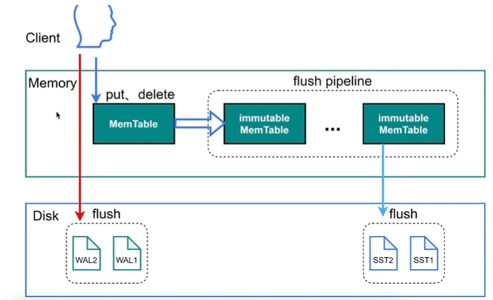
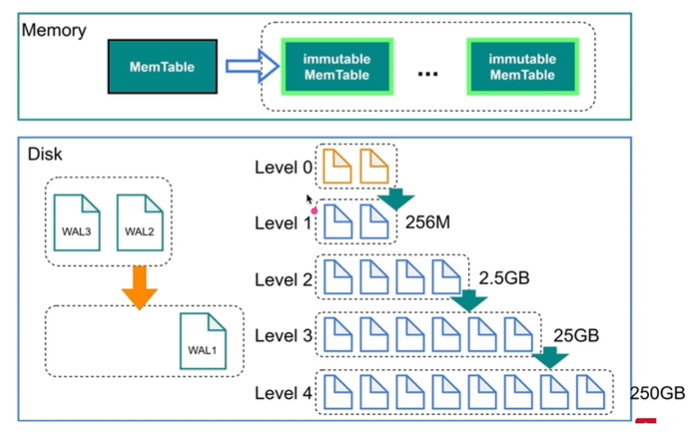
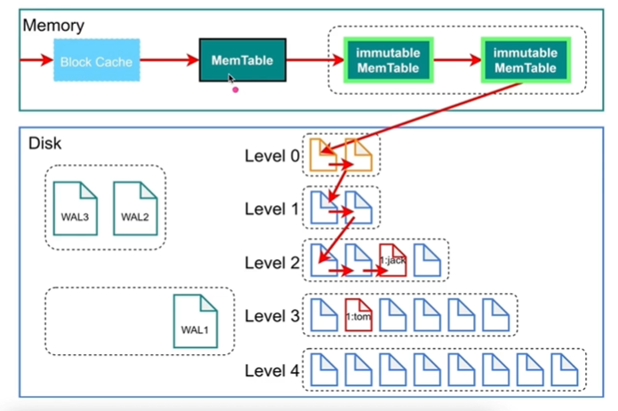
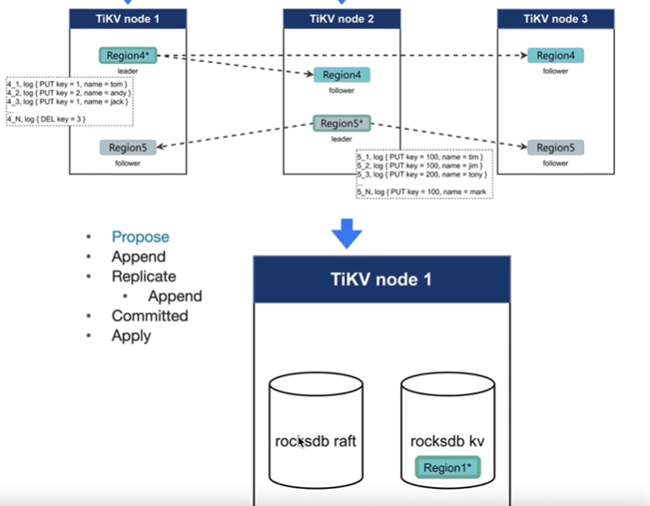
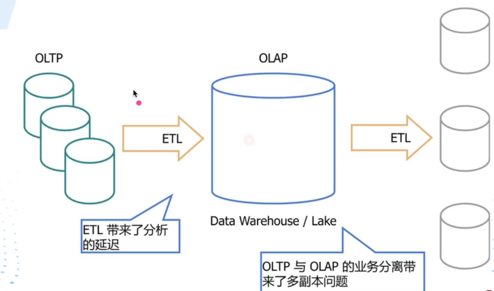

# 1-存储引擎-RocksDB

## 写入

RocksDB于TiDB，类似InnoDB于MySQL。TiKV的数据没有直接写在磁盘上，内存与磁盘中间夹了一层RocksDB。对于TiKV来说数据写入RocksDB，具体的刷盘策略、机制由RocksDB负责。

写入一条数据，先刷盘到WAL文件里，防止数据丢失**（类似MySQL Redo Log一阶段提交的功能？）**，然后写入内存里的MemTable，MemTable被写满后会复制成Immutable Memtable（有点类似Kafka的Batch机制），RocksDB将Immutable Memtable刷盘。MemTable和Immutable Memtable可以抽象理解为InnoDB的BufferPool，也因为Immutable的存在，MemTable写操作在刷盘时不会被阻塞，因为刷的是Immutable Memtable。

Immutable Memtable被flush pipeline流控着，如果Memtable的写入速度太快，超过Immutable Memtable的刷盘次数，Immutable Memtable会在flush pipeline堆积，当flush pipeline的Immutable Memtable≥5个时，Memtable的写入速度就会被放缓，同时发出日志告警。

## 存储

在RocksDB里，磁盘里的数据有Level之分，从0开始递增有多个Level。每一个Level都有它的数据容量，当前Level的数据容量到达阈值后，会将当前Level的数据进行压缩，迁移存放到下一个Level。对于Level0来说，容量阈值是4个Immutable，对于Level1来说，容量阈值是256M，对于Level2来说，容量阈值是2.5GB......每一级Level都被上一级Level要高。

## 查询

**TiDB的KV数据存储是有序的，排序依据是Key的二进制值**。查询过程中优先看Block Cache，再看MemTable，再看Immutable，实在没有就从磁盘获取，即使是从磁盘取，也是按照Level从低到高的排序查询。但这样会遍历多个Immutable，效率有点低，因此RocksDB为每一个Level维护了【当前Level的key范围】，遍历的时候只需判断要查找的key是否命中当前范围就好了，如果不命中则直接跳到下一个Level。除此以外，RocksDB还提供了一个布隆过滤器，协助判断数据是否命中Level。

# 2-数据同步

回顾一下，Region作为存储单位，KV按照Key的二进制排序，有序存放在Region内，1个Region的默认容量是96MB，Region的容量超出144MB后，会进行Region的拆分，形成2个Region。

Region与Region之间基于Raft协议进行数据同步，通过TiDB Server操作写请求到TiKV，实际上TiKV收到的是一条一条的Log，一个写操作对应一个Log。Log也是KV格式，Key是${Region编号}_${Log的ID}，Value是log{实际操作数据}。Region收到Log后，不会立刻走RocksDB的存储逻辑，而是先走一个同步过程。

同步过程指的是Leader与Follower之间的同步，同步的数据单位是Log。**首先要明确，RocksDB的存储过程基于RocksDB KV，同步过程基于RocksDB Raft，每一台TiKV节点同时拥有Rocks KV与RocksDB Raft**。Log被Leader接收后，会经历以下步骤：

1. Propose：将Log标记为 “已收到”。
2. Append：将Log写入RocksDB Raft。
3. Replicate：将Log同步给Follower。
4. Replicate-Append：Follower将Log写入自己的RocksDB Raft，写入完成后向Leader响应Ack。
5. Committed：Leader收到半数以上的Ack（包含自身Append后的Ack），就会认为本次Log同步成功。
6. Apply：将Log写入RocksDB KV，同时通知Follower也将Log写入RocksDB KV。

之后，就是走RocksDB的存储逻辑了（Memtable → Immutable → Disk）。

# 3-MVCC

TiDB的MVCC是用来解决不可重复读冲突的，MySQL也不例外。假设有这么一个场景：

1. 事务A在时间戳T开始，读取第N行数据。
2. 事务B在时间戳T+1开始，修改第N行数据的值。
3. 事务A在时间戳T+2，读到第N行数据。

明明事务A从T开始读，却会读到事务B在T+1修改的新数据，也就是不可重复读。如果没有MVCC，需要事务A对行上锁（比如FOR UPDATE），防止其他事务修改，但这样效率太差了。对于MySQL来说，可以通过RR隔离级别避免，本质是通过ReadView + 遍历行记录的undo log链实现MVCC，从而读到正确的值。

**对于TiDB来说，MVCC基于TSO进行**（联动03-9的因果一致性事务）。TSO作为版本号添加到行记录Key的后缀，多个事务之间的写操作本质是行记录的追加。比如：

1. 事务A在时间戳T新增行记录N，此时Region存放[KeyN_T → value]
2. 事务B在时间戳T+1修改行记录N，此时Region存放[KeyN_T → value , KeyN_T+1 → value2]

这样不会因为数据量冗余，导致存储空间告警吗？回顾一下上面RocksDB的存储，数据从低Level到高Level会经过压缩，我猜压缩就是针对同Key不同TSO的记录取最新值，舍弃旧值（类似Kafka的消息压缩策略）。

因为KeyN作为Key的前缀是一致的，所以N记录代表的KV都会处于同一个Region。有了这个TSO的存在，事务A不会读到事务B修改的数据，因为事务A开始的TSO ＜ 事务B开始的时间戳。

# 4-OLTP、OLAP、HTAP

## OLTP（On line Transaction Processing）

1. 并发程度高。
2. 一致性要求高。
3. 每次操作少量的数据。

讲这么多，其实和日常业务开发的SQL事务差不多，比如转账场景、同时更新A记录B记录的场景。这种场景实际操作数据是比较少的，并且可以通过行锁的机制保证隔离性、减少锁的粒度大小，因此并发程度和吞吐量相对较高，操作瓶颈不取决于高并发带来的竞争性。**对于OLTP场景，使用行式存储是合适的选择，典型的就是MySQL的InnoDB引擎。**

## OLAP（On line Analysis Processing）

1. 并发数程度低。
2. 一致性要求低。
3. 每次需要扫描大量的数据。

而OLAP更多是对大批量数据的查询、更新，并且执行频率很低，一般用于数据分析，和产品的业务主流程不挂钩。

打个比方我要查询所有行记录的X值、Y值进行分析，如果采用行存储需要一行一行的遍历所有行记录，效率会很低，因此OLAP场景更适合用列式存储，典型的就是Cassandra。关于列式存储，之前整理过一篇笔记：

## HTAP（Hybrid Transaction Analytical Processing）

而HTAP可以理解为OLTP与OLAP的混合解决方案，传统的HTAP解决方案是这样的：

1. 数据库分为OLTP处理数据库、OLAP处理数据库。
2. OLTP处理数据库依旧用来处理产品的业务主流程。
3. 通过ETL技术将数据从OLTP复制到OLAP处理数据库，形成数据分析的副本。
4. OLAP分析数据的结果，再通过ETL传送到各个数据库（类型随意），进行下一步的处理。

这种解决方案依赖ETL技术作为桥梁，比如Kafka、Canal等中间件。引入中间件意味着延迟与弱一致，在一些数据量级或者业务场景下甚至能达到T+1、T+2的延迟。并且OLTP与OLAP的分离，也导致一份数据产生了多分副本，分散存储在不同数据库上。

**总的来说，这种HTAP解决方案不适用于 追求实时分析 && 一致性要求高 && 并发程度高的场景**。

**简单来说，我现在既要保证业务主流程的处理能力，又要保证实时分析的能力**。

对于这样的HTAP解决方案，可以提炼到以下几个要点：

1. 可扩展性

   这种业务场景往往数据量很大，数据存储应该支持分布式存储，通过副本与ack机制保证一致性。为了兼容OLTP，需要支持分布式事务。

2. 需要同时支持行存、列存

   OLTP的核心是行存，OLAP的核心是列存，因此数据的存储方式要同时支持行存与列存。

3. 业务隔离

   产品的业务主流程只会操作行存数据，产品的分析流程只会操作列存数据。

4. 行存储与列存储的同步

   为了支持实时分析的能力，对于行存数据的写操作，需要同步到列存（**不是强一致性，下面介绍TiFlash会讲到**）。
