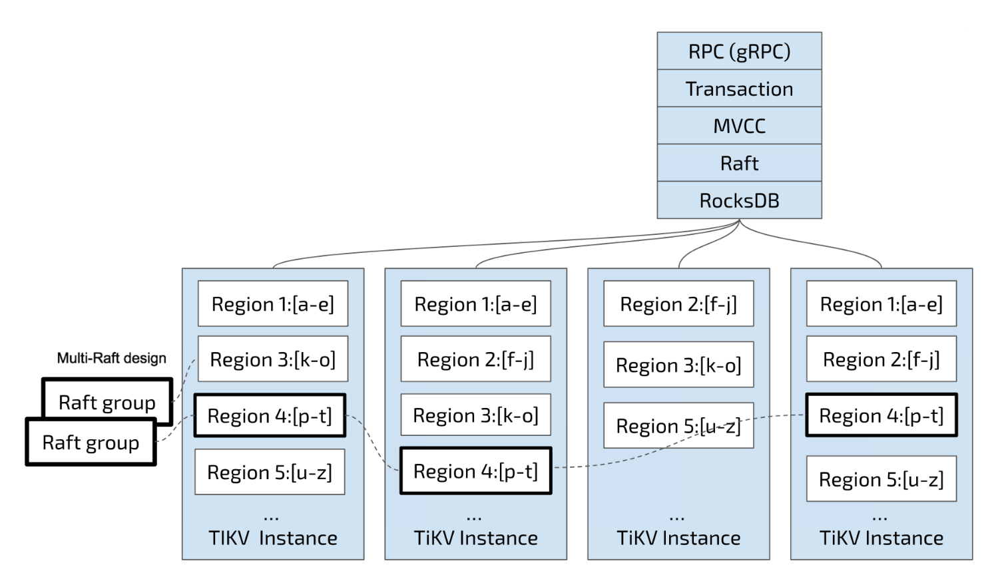

# 数据存放

涉及到数据的分布式存储定位，无非就2种方案：

1. 按照数据的唯一标识符（如ID）进行哈希，将哈希结果与分片数量进行%运算，得出数据存放位置。
2. 按照数据的唯一标识符进行排序，通过划分范围的方式，得出数据的存放数据。

前者能够降低尾热问题，但扩容难，如果扩容后不进行重新哈希，有可能会出现数据存放不一致的问题，后者相反。

不管是这是老问题了，如同CAP一般难以取舍，虽然有一致性哈希方案，但本质还是有扩容难，顶多是将重新哈希的成本降低了而已。至于Redis Cluster为什么没有扩容难的问题，因为1个Redis Cluster固定了数据的分片数量，不管是手动扩容还是缩容，本质是将分片的位置从一个节点迁移到另一个节点而已，结合Redis客户端对MOVED和ASK的适应性操作，能够让使用者无感知，这点在之前的[笔记](https://github.com/9029HIME/Emphasis/blob/master/redis_emphasis/md/03-%E4%BD%BF%E7%94%A8Redis%20Cluster%E6%97%B6%E8%A6%81%E6%B3%A8%E6%84%8F%E7%9A%84%E4%B8%80%E4%BA%9B%E5%9D%91.md)也介绍过。

而Kafka Cluster作为消息队列，消息的发送需要分片，而消息的读取却不用，Kafka客户端发现Partition Leader位置迁移后发生错误后会重新刷新分片元信息，并将新消息发送到新分片上，总的来看没什么问题，除了极端场景下有序的新旧消息会被乱序消费，这点在之前的[笔记](https://github.com/9029HIME/Emphasis/blob/master/kafka_advance/md/03-%E6%B7%B1%E5%85%A5Broker.md)也介绍过。

**至于TiDB，它选择了后者，采用划分范围的方式，将每一行（KV）存储到不同的Region上。**

对于TiDB来说，Key是可排序的，TiKV将一段连续的KV存入Region，直至达到阈值则产生Region分裂，1个Node只有1个Region，多个Region会均匀分布到不同TiKV上，rebalance动作由PD触发。默认情况下，所有的读和写都是通过 Leader 进行，读操作在 Leader 上即可完成，而写操作再由 Leader 复制给 Follower（和Kafka Cluster一致）。

# 热点写

## 默认情况

然而在创建表之后，TiDB只会给表分配1个Region，**在表使用非聚簇索引主键或不使用主键时， TIDB也会给每一行分配一个`_tidb_rowid` 列作为行 ID，并用行ID生成一个隐式的聚簇索引**，在不使用 SHARD_ROW_ID_BITS 的情况下，_tidb_rowid 列的值基本也为单调递增。也就是说，在默认情况下，TiDB的Region热点写入问题十分普遍，**这个问题也很符合TiDB使用Key范围来定位数据所在Region的方式。**

随着数据持续写入，TiKV 会将一个 Region 切分为多个。但因为首先发起选举的是原 Leader 所在的Node1，所以新切分好的两个Region Leader 很可能还会在Node1。新切分好的 Region 2，3 上，也会重复之前发生在 Region 1上的过程。也就是压力会密集地集中在Node1 上。

在持续写入的过程中，PD 发现Node1中产生了热点，会将 Region Leader 均分到其他的 Node 上。如果 TiKV 的节点数多于副本数的话，PD会尽可能将 Region 迁移到空闲的节点上。

## Region预分配

通过`默认情况`可以发现，热点写主要有2个方面造成：

1. 初始状态只有1个Region
2. key有序

而Region的预分配，是从1.出发，在建表时通过指定SPLIT REGION，可以确定表在初始化时的Region数量。

## 非自增唯一标识

然而即使对Region进行了预分配操作，即使有多几个Region，如果还是采用自增写（主键或row_id）的方式，写入的数据还是会集中到某个特定的Region上，产生尾热问题，因此可以从2个方面入手：

1. 使用非自增聚簇索引主键。
2. 不使用聚簇索引主键，但使用SHARD_ROW_ID_BITS。

在不使用聚簇索引主键并使用SHARD_ROW_ID_BITS后，TiDB可以把row_id打散写入多个不同的 Region，缓解写入热点问题。但是！SHARD_ROW_ID_BITS 的值可以动态修改，每次修改之后，只对新写入的数据生效。这也是不容忽视的避免，并且通常情况下，项目会使用聚簇索引主键，因此这个方案显得有点尴尬。

# 数据定位和热点写的思考

从Sharding Proxy、Redis Cluster、Kafka Cluster，再到目前的TiDB，分布式数据定位的矛盾总是围绕着“按范围有热点写入问题，按分片有数据扩容问题”展开。TiDB采用了前者，并且官网也强调了许多热点写的注意事项，看得出来是为了保证“分布式数据库”的可扩容性。

TiKV会根据Region的最大值进行分裂，新的数据会写入于分裂出来的新Region。由TiKV的分裂机制 + 上报分裂行为给PD + Region迁移到TiKV其他这3个操作，平衡了Region在TiDB Cluster的可扩展性和读写均衡带来的优缺点。