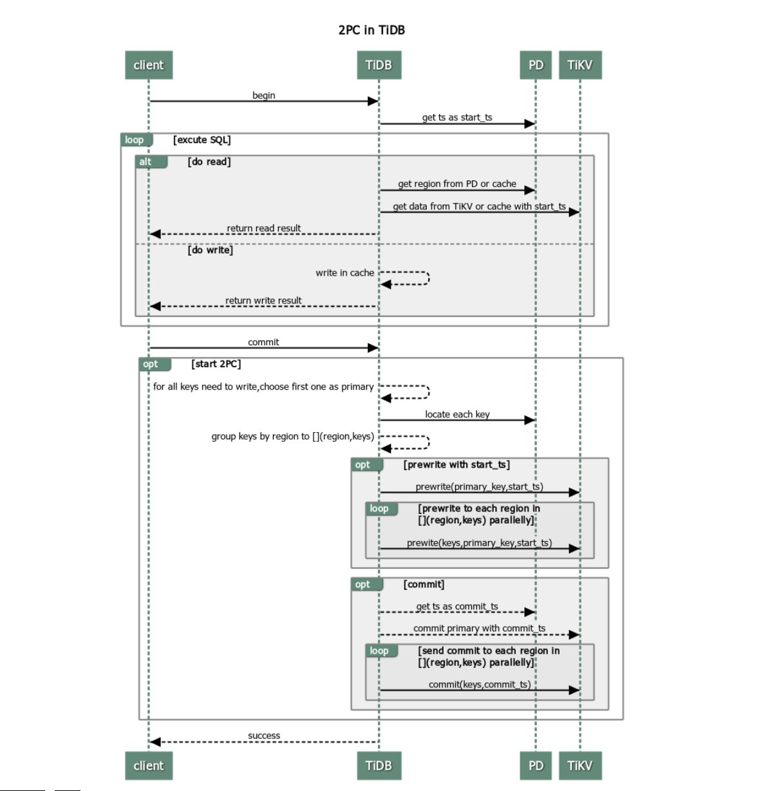
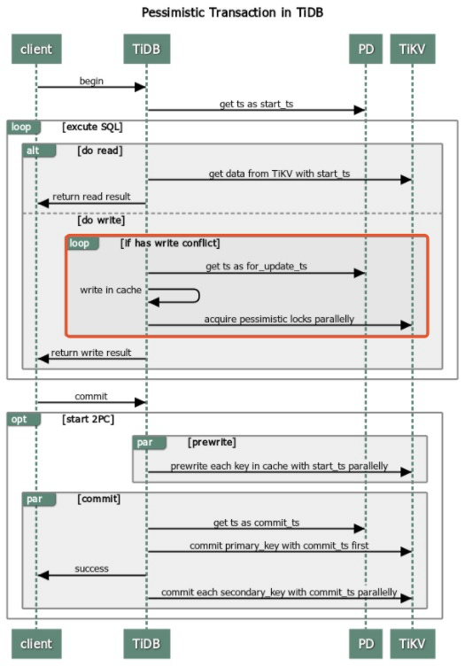

# 宏观

先下一个定义：不管是乐观事务还是悲观事务，我认为TiDB采用2PC提交的分布式事务模式，有点类似Seata的AT模式，区别是Seata是中间件层面实现的2PC（数据库一阶段提交，Seata+客户端代码二阶段提交），而TiDB是数据库层面的2PC（数据库一阶段提交，数据库二阶段提交）。相对于Seata来说，TiDB的分布式事务没有明显的代码侵入性，对于Client来说只是单纯的进行BEGIN;COMMIT;两部曲，整个2PC的过程完全由TiDB Server 与 TiKV进行。

**或者说：TiDB的分布式对于客户端而言是XA，但落实到TiDB Server来说却是AT。不过TiDB和Seata是两种不同概念的东西，前者是数据库，后者是非异构语言的分布式事务框架，没必要纠结2者的相似性。**

TiDB在开启事务后即会获取当前数据库快照，而 MySQL 的 BEGIN 和 START TRANSACTION 是在开启事务后的第一个从 InnoDB 读数据的 SELECT 语句（非 SELECT FOR UPDATE）后获取快照，START TRANSACTION WITH CONSISTENT SNAPSHOT 是语句执行时获取快照。因此，TiDB 中的 BEGIN、START TRANSACTION 和 START TRANSACTION WITH CONSISTENT SNAPSHOT 都等效为 MySQL 中的 START TRANSACTION WITH CONSISTENT SNAPSHOT。

Read Committed 隔离级别仅在悲观事务模式下生效。在乐观事务模式下设置事务隔离级别为 Read Committed 将不会生效，事务将仍旧使用可重复读隔离级别。

# 乐观事务

乐观事务的最大优点是减少冲突检测带来的网络耗时，在低冲突场景里使用乐观事务可以增加系统的吞吐量。因为在执行每一条写语句的时候TiDB Server不会检查语句的冲突性，**而是在2PC的P阶段进行冲突检测，也就是说，当乐观事务发生冲突时，只会在提交阶段暴露，在没有开启事务重试的情况下会直接提交失败。**

事务开始、读写：

1. 之前已经介绍过TiDB的MVCC主要由时间戳来控制，因此开启事务时会从PD获取1个start_ts。
2. 事务周期内的读取，都是基于start_ts进行的。
3. 事务周期内的写入，经过**数据规范校验**后，直接写进TiDB Server的内存里，保证乐观事务**不做冲突校验**。

事务提交：

1. 客户端发起commit后，TIDB Server会随机选出1个Key作为Primary Key。
2. TiDB Server并行获取本次需要写操作的Key的元数据，并Group成Region：Keys。
3. 循环每一个需要写操作Key，并行地发起prewrite（一阶段）请求，TiKV收到某个key的prewrite请求后，会进行冲突校验，并返回结果。
4. TiDB Server收到所有key的prewrite response都是成功后，从PD获取一个commit_ts，并行地向key所在的TiKV发起commit（二阶段）请求，TiKV在完成一些数据规范校验后，会清除这个key在prewrite阶段上的锁，并响应成功给TiDB Server。
5. TiDB Server收到所有Key的commit response都是成功后，返回给client事务提交成功。

注意，1-5这个步骤同步贯穿整个客户端commit过程。

# 悲观事务

可以理解为MySQL中的事务，和TiDB乐观事务不同的是，TiDB悲观事务在事务周期内写入时就会进行数据的冲突校验，和MySQL一样，TiKV会在这个时候阻塞等待另一个事务的提交或回滚直至超时。值得注意的是：TiDB不支持gap lock，因此只会对符合条件的数据进行上锁：

总的来说和乐观事务差别不大，主要是冲突校验的过程放在了执行写操作阶段。

但是在金融领域或者对数据一致性要求很高的场景下，要注意TiDB以下特性可能会导致悲观锁失效；

## 锁的一致性危机-pipelined加锁

加悲观锁需要向 TiKV 写入数据，要经过 Raft 提交并 apply 后才能返回，相比于乐观事务，不可避免的会增加部分延迟。为了降低加锁的开销，TiKV 实现了 pipelined 加锁流程：当数据满足加锁要求时，TiKV 立刻通知 TiDB 执行后面的请求，并异步写入悲观锁，从而降低大部分延迟，显著提升悲观事务的性能。但当 TiKV 出现网络隔离或者节点宕机时，悲观锁异步写入有可能失败，从而产生以下影响：

1. 无法阻塞修改相同数据的其他事务。如果业务逻辑依赖加锁或等锁机制，业务逻辑的正确性将受到影响。

2. 有较低概率导致事务提交失败，但不会影响事务正确性。

如果业务逻辑依赖加锁或等锁机制，或者即使在集群异常情况下也要尽可能保证事务提交的成功率，应关闭 pipelined 加锁功能。

## 锁的一致性危机-内存悲观锁

TiKV 在 v6.0.0 中引入了内存悲观锁功能。开启内存悲观锁功能后，悲观锁通常只会被存储在 Region leader 的内存中，而不会将锁持久化到磁盘，也不会通过 Raft 协议将锁同步到其他副本，因此可以大大降低悲观事务加锁的开销，提升悲观事务的吞吐并降低延迟。

当内存悲观锁占用的内存达到 Region 或节点的阈值时，加悲观锁会回退为使用 pipelined 加锁流程。当 Region 发生合并或 leader 迁移时，为避免悲观锁丢失，TiKV 会将内存悲观锁写入磁盘并同步到其他副本。

内存悲观锁实现了和 pipelined 加锁类似的表现，即集群无异常时不影响加锁表现，但当 TiKV 出现网络隔离或者节点宕机时，事务加的悲观锁可能丢失。

如果业务逻辑依赖加锁或等锁机制，或者即使在集群异常情况下也要尽可能保证事务提交的成功率，应关闭内存悲观锁功能。